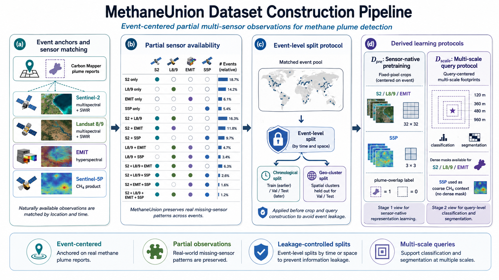

<p align="center">
  
</p>

**MethaneUnion** is an event-centered partial multi-sensor satellite dataset for methane plume detection.

MethaneUnion is built from Carbon Mapper plume reports and matched satellite observations from Sentinel-2, Landsat 8/9, EMIT, and Sentinel-5P. The dataset is designed for partial-observation learning, where each plume event is associated with only the subset of sensors naturally available at the target location and time.

## Overview

Satellite methane plume detection is limited by incomplete sensor availability. Many reported plume events do not have valid Sentinel-2 observations because of revisit timing, cloud coverage, acquisition quality, and the transient lifetime of methane emissions. Other satellite sources provide complementary evidence, but they do not form a fully paired multi-sensor dataset.

MethaneUnion organizes this setting as an event-centered partial-observation dataset. Each Carbon Mapper plume report defines an event anchor, and naturally available satellite observations are matched around the event location and time. The dataset supports methane plume classification and segmentation under realistic missing-sensor patterns.

## Data Sources

MethaneUnion combines plume reports and satellite products from the following sources:

| Source | Product | Role |
| --- | --- | --- |
| Carbon Mapper | Plume reports and plume masks | Event anchors and reference plume masks |
| Sentinel-2 | Level-2A surface reflectance | Fine-resolution multispectral and SWIR observations |
| Landsat 8/9 | Collection 2 Level-2 surface reflectance | Additional multispectral and SWIR observations |
| EMIT | Level-2A hyperspectral surface reflectance | Hyperspectral methane-sensitive observations |
| Sentinel-5P | Level-2 methane product | Coarse atmospheric CH4 context |

## Dataset Statistics

MethaneUnion expands valid Sentinel-2-only coverage from **3,211** events to **8,981** observable multi-sensor events after sensor matching and quality filtering.

| Dataset view | Description |
| --- | --- |
| Sentinel-2-only valid observations | 3,211 events |
| MethaneUnion observable multi-sensor events | 8,981 events |
| Supported sensors | Sentinel-2, Landsat 8/9, EMIT, Sentinel-5P |
| Label types | Query-level classification labels; dense plume masks for supported sensors |
| Evaluation scales | 120 m, 360 m, 480 m, 960 m |

## Dataset Design

MethaneUnion is not a fully paired multi-sensor dataset. For each event, only the available sensors are included. Missing sensors are preserved as part of the dataset structure instead of being imputed or replaced by dummy observations.

The dataset is split at the Carbon Mapper event level before crop and query construction. All observations, crops, and queries derived from the same plume report are assigned to the same partition to avoid event leakage.

MethaneUnion supports two derived learning protocols:

### `D_pre`: Sensor-native pretraining protocol

`D_pre` uses fixed-pixel crops from each available sensor for Stage 1 sensor-native representation learning.

| Sensor | Crop size |
| --- | ---: |
| Sentinel-2 | 32 x 32 pixels |
| Landsat 8/9 | 32 x 32 pixels |
| EMIT | 32 x 32 pixels |
| Sentinel-5P | 3 x 3 pixels |

Each crop receives a binary methane label according to whether its geographic footprint overlaps the Carbon Mapper plume mask.

### `D_scale`: Multi-scale query protocol

`D_scale` defines query-level classification and segmentation samples at controlled geographic footprints.

| Query scale | Task |
| ---: | --- |
| 120 m | Classification and segmentation |
| 360 m | Classification and segmentation |
| 480 m | Classification and segmentation |
| 960 m | Classification and segmentation |

For Sentinel-2, Landsat 8/9, and EMIT, dense segmentation masks are generated by reprojecting the Carbon Mapper plume mask to the sensor grid. Sentinel-5P is used as coarse CH4 context and is not used for dense plume-mask supervision.

## Repository Structure

This repository currently contains the following main components:

```text
MethaneUnion/
├── methaneunion_pipeline.png        # README figure
├── configs/                         # Configuration files
├── data/                            # Dataset metadata and intermediate outputs
├── data_csv/                        # CSV manifests and split-related tables
├── data_downloading/                # Data acquisition utilities
├── data_preprocess/                 # Shared preprocessing code
├── preprocess_dataset_EMIT/         # EMIT preprocessing pipeline
├── preprocess_dataset_L89/          # Landsat 8/9 preprocessing pipeline
├── preprocess_dataset_multisensor/  # Multi-sensor matching and fusion prep
├── preprocess_dataset_query_multi/  # Query construction pipeline
├── preprocess_dataset_s2/           # Sentinel-2 preprocessing pipeline
├── preprocess_dataset_s5p/          # Sentinel-5P preprocessing pipeline
├── train/                           # Training code and model components
└── util/                            # Utility functions
```

## Data Format

Each event is represented by an event-level record containing:

```text
event_id
event_time
latitude
longitude
available_sensors
sensor_observation_paths
plume_mask_path
split
metadata
```

Each query-level record contains:

```text
query_id
event_id
query_time
query_center
query_scale_m
available_sensors
classification_label
segmentation_mask_paths
sensor_crop_paths
split
```

The exact file schema can be documented in a future `docs/data_schema.md`.

## Splits

MethaneUnion provides two event-level split protocols:

| Split | Purpose |
| --- | --- |
| Chronological split | Main deployment-aligned evaluation protocol |
| Geo-cluster split | Spatial robustness evaluation under held-out macro-regions |

Both splits are applied before crop and query construction.

## Usage

This repository currently focuses on dataset construction, preprocessing, and training code. Typical usage is:

1. Download or access the processed MethaneUnion data.
2. Use the preprocessing scripts in `preprocess_dataset_*` and `preprocess_dataset_query_multi/` to build sensor-specific crops and query manifests.
3. Use the training code under `train/` with the generated manifests and splits.

If you want a package-style dataset loader, add a dedicated loader module and document its manifest schema in `docs/`.

## Relation to MethaneFuse

MethaneUnion is the dataset and evaluation protocol used by MethaneFuse. The model implementation is maintained in the companion repository:

```text
https://github.com/yuyao-wang/MethaneFuse
```

## Data Access

The processed dataset and manifests are released at:

https://huggingface.co/datasets/yuyao42/MethaneUnion
